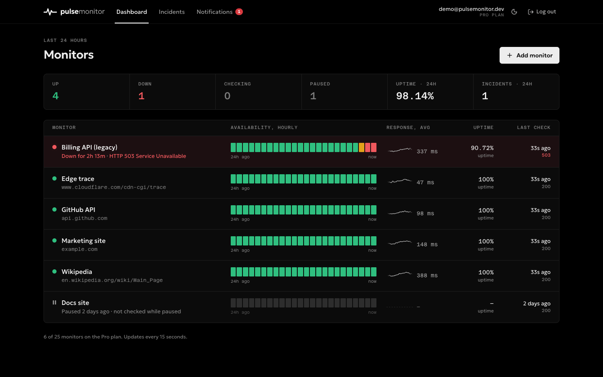
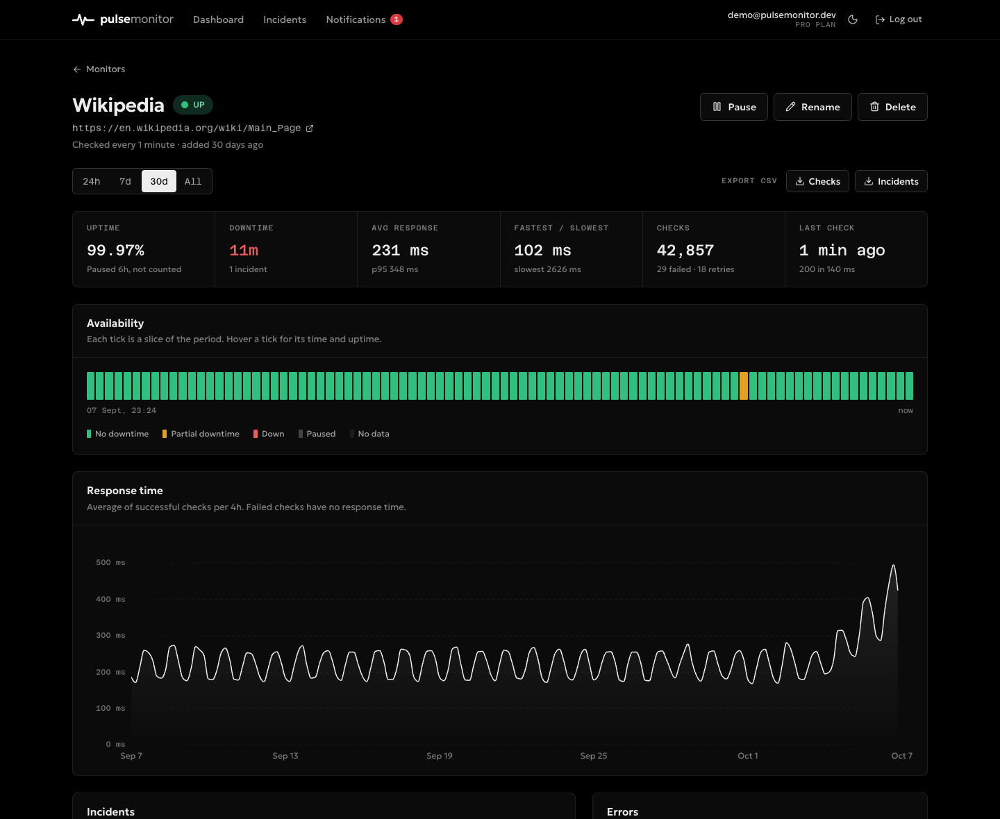
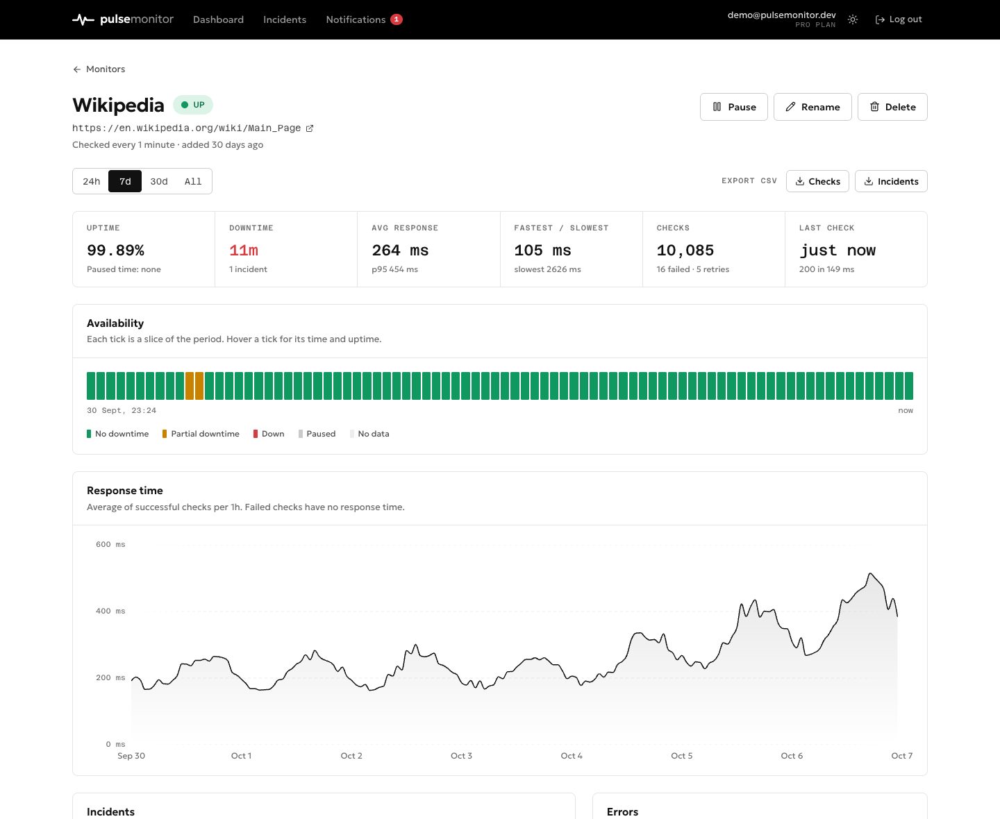
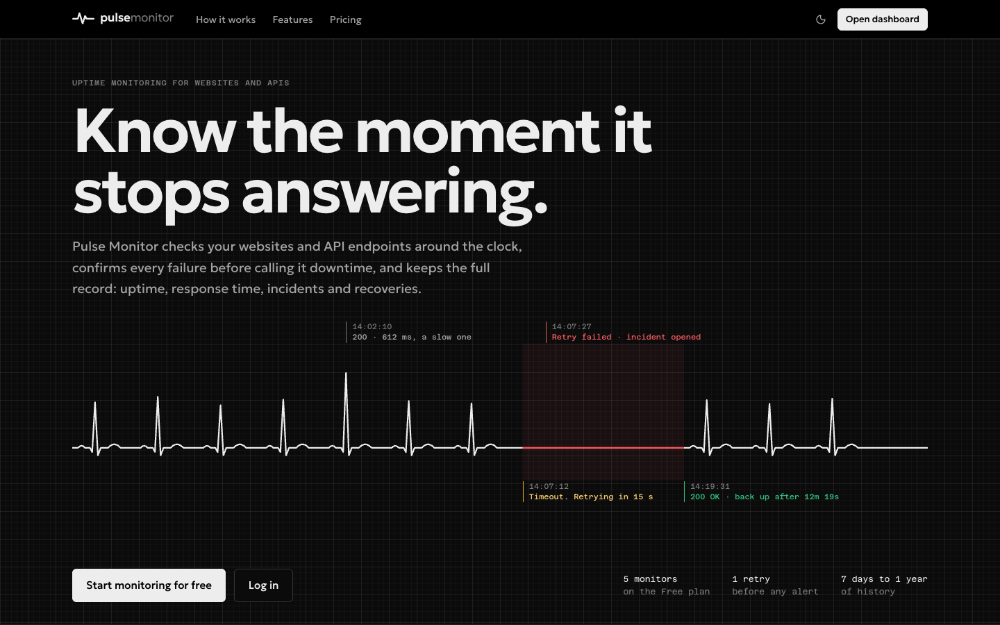

# Pulse Monitor

Uptime monitoring for websites and APIs. Add a URL and Pulse Monitor checks it from the server on a
schedule, confirms every failure with a retry, opens an incident when the service is really down,
closes it on recovery, and keeps the whole record: uptime, downtime, response time, every check and
every incident.

Everything is real. Checks are HTTP requests made with Node's native `fetch`, all data lives in
PostgreSQL, and the scheduler runs on the server whether or not anyone has the app open.



| Monitor page (dark, the default)                                                                                                         | Light theme                                                                                 |
| ---------------------------------------------------------------------------------------------------------------------------------------- | ------------------------------------------------------------------------------------------- |
|  |  |

**Highlights**

- One retry before anything is called down, so a dropped packet is a logged blip, not an incident.
- Uptime and downtime are computed from incidents and pause intervals for any period, never
  stored, and paused time counts as neither.
- A state machine with one locked transaction per check result; scheduling claims due monitors
  with `FOR UPDATE SKIP LOCKED`, so several scheduler processes can share the work.
- SSRF protection on every request and redirect hop, scrypt passwords, httpOnly session cookies,
  CSRF origin checks, rate limits, and CSV exports safe from formula injection.
- Plan limits (monitors, check interval, history kept) enforced by the backend from one source.
- 27 tests, including an integration suite against PostgreSQL and a local HTTP server.

**Demo account.** `npm run db:seed` creates `demo@pulsemonitor.dev` / `pulse-demo-2026` with six
monitors on real public URLs and 30 days of generated history. It runs on the Pro plan, so a paid
plan can be seen working (checks every minute, 90 days of history) even though Pro and Business are
not on sale: there are no payments in V1.



## Contents

- [Quick start](#quick-start)
- [Stack](#stack)
- [Architecture](#architecture)
- [Folder structure](#folder-structure)
- [Setup in detail](#setup-in-detail)
- [Environment variables](#environment-variables)
- [Database](#database)
- [Monitoring engine](#monitoring-engine)
- [Uptime and downtime](#uptime-and-downtime)
- [API](#api)
- [Security](#security)
- [Emails with Resend](#emails-with-resend)
- [Themes](#themes)
- [Deploying to Render](#deploying-to-render)
- [Technical decisions](#technical-decisions)
- [V1 limitations](#v1-limitations)
- [Scaling: from cron to workers and queues](#scaling-from-cron-to-workers-and-queues)

## Quick start

Requirements: Node.js 22 or newer, PostgreSQL 14 or newer (the queries use `date_bin`).

```bash
npm run setup                          # installs server and client dependencies
createdb pulse_monitor
cp server/.env.example server/.env     # then set JWT_SECRET (see below)
npm run db:seed                        # runs migrations, then loads demo data
npm run dev:server                     # API + scheduler on http://localhost:4000
npm run dev:client                     # web app on http://localhost:5174 (in a second terminal)
```

Open http://localhost:5174 and log in with the demo account:

| Email                   | Password          |
| ----------------------- | ----------------- |
| `demo@pulsemonitor.dev` | `pulse-demo-2026` |

Generate a `JWT_SECRET` with:

```bash
node -e "console.log(require('crypto').randomBytes(48).toString('base64url'))"
```

Run the tests (unit tests plus an integration suite against the database and a local HTTP server):

```bash
npm test
```

Type-check, lint and build the client:

```bash
npm --prefix client run build   # tsc -b, then vite build
npm --prefix client run lint    # oxlint
```

## Stack

| Layer       | Choice                                                              |
| ----------- | ------------------------------------------------------------------- |
| Frontend    | React 19, TypeScript, Vite, Tailwind CSS v4, React Router           |
| Charts      | [Bklit](https://bklit.com) area and line charts (shadcn registry)   |
| Backend     | Node.js, Express 5                                                  |
| HTTP checks | Native `fetch` (Node's built-in undici)                             |
| Database    | PostgreSQL with plain SQL through `pg`. No ORM.                     |
| Scheduling  | `node-cron`, inside the API process or as its own process           |
| Email       | Resend (password reset only)                                        |
| Hosting     | Render: one web service and one PostgreSQL database (`render.yaml`) |

Nothing else was added: no Redis, queues, Docker or GraphQL. The small extra dependencies are
`jsonwebtoken` (session tokens), `cookie-parser`, `helmet` (security headers) and
`express-rate-limit` (auth endpoints). Password hashing uses `scrypt` from `node:crypto`, so there
is no native module to compile.

## Architecture

```
                 ┌──────────────────────────── Node process ────────────────────────────┐
 Browser ──HTTP──▶ Express: routes → controllers → services → repositories ──SQL──┐       │
 (React SPA)     │                                                                  │       │
                 │ node-cron tick (5 s) → scheduler → runner → http-check (fetch)   ▼       │
                 │                               └→ record-result (state machine) → PostgreSQL
                 └──────────────────────────────────────────────────────────────────────────┘
```

- **Web app.** A React SPA. In development Vite serves it on port 5174 and proxies `/api` to
  Express. In production Express serves the built files, so the app and the API share one origin
  and the session cookie stays first-party.
- **API.** Express with a layered structure: routes declare endpoints, controllers translate HTTP
  to calls, services hold business rules, repositories hold every SQL statement.
- **Monitoring engine.** Separate from the API code in `server/src/monitoring/`. It is split so
  each part can move independently: the scheduler decides _when_, the runner decides _what_, and
  the state machine decides _what it means_.
- **Scheduler placement.** By default the API process also runs the scheduler
  (`RUN_SCHEDULER=true`). Set it to `false` and run `npm run scheduler` to move checks into their
  own process. Claiming uses `FOR UPDATE SKIP LOCKED`, so several scheduler processes can run at
  once without checking the same monitor twice.

## Folder structure

```
pulse-monitor/
├── package.json              root scripts (setup, dev, build, start, test)
├── render.yaml               Render Blueprint
├── server/
│   ├── src/
│   │   ├── index.js          API process (runs migrations, starts API and scheduler)
│   │   ├── scheduler-only.js scheduler as its own process
│   │   ├── app.js            Express app: middleware, routes, static client
│   │   ├── config/           env.js (validated env), plans.js, monitoring.js
│   │   ├── db/               pool, migration runner, migrations/*.sql, seed.js
│   │   ├── routes/           endpoint map
│   │   ├── controllers/      HTTP in, JSON or CSV out
│   │   ├── services/         auth, monitors, metrics, availability, periods, export, email
│   │   ├── repositories/     all SQL, parameterized
│   │   ├── monitoring/       scheduler, runner, http-check, evaluate, transitions,
│   │   │                     record-result, network-guard (SSRF), connectivity
│   │   ├── jobs/             retention sweep
│   │   ├── middleware/       auth, security (CSRF origin check, rate limits), errors
│   │   └── utils/            logger, errors, validation, URL normalization
│   └── test/                 unit.test.js, lifecycle.test.js
└── client/
    ├── index.html
    └── src/
        ├── App.tsx           routes and code splitting
        ├── auth/             session context, provider and route guards
        ├── pages/            landing, auth pages, dashboard, monitor detail, incidents, notifications
        ├── components/       UI kit, status strip, charts wrapper, dialogs, app shell, hero trace
        ├── components/charts Bklit chart components (installed from the registry, lightly adapted)
        ├── hooks/            useApi (fetch + polling), usePlans, useNow
        └── lib/              API client, types, formatting
```

## Setup in detail

### PostgreSQL

Any local PostgreSQL 14+ works. With Homebrew:

```bash
brew install postgresql@17 && brew services start postgresql@17
createdb pulse_monitor
```

Set `DATABASE_URL` in `server/.env`, for example `postgres://localhost:5432/pulse_monitor`.

### Migrations

Migrations are plain SQL files in `server/src/db/migrations/`, applied in name order by a small
runner that records them in `schema_migrations`. They run automatically when the server starts, or
manually:

```bash
npm run db:migrate
```

To change the schema, add a new file such as `002_add_expected_status.sql`. Never edit a migration
that has already run.

### Seed

```bash
npm run db:seed
```

Creates the demo account on the Pro plan with six monitors and 30 days of history (about 220,000
checks). The monitors point at **real public URLs**, and from the moment the server starts the
scheduler keeps checking them for real:

| Monitor              | URL                                               | State                                                   |
| -------------------- | ------------------------------------------------- | ------------------------------------------------------- |
| Marketing site       | `https://example.com/`                            | Up, two resolved incidents                              |
| GitHub status        | `https://www.githubstatus.com/api/v2/status.json` | Up, one resolved incident                               |
| Wikipedia            | `https://en.wikipedia.org/wiki/Main_Page`         | Up, latency rising over the last 3 days, one past pause |
| Billing API (legacy) | `https://httpbin.org/status/503`                  | Down, active incident (the URL really answers 503)      |
| Docs site            | `https://developer.mozilla.org/en-US/`            | Paused two days ago, history kept                       |
| Edge trace           | `https://www.cloudflare.com/cdn-cgi/trace`        | Up, created five days ago                               |

The past history is generated (deterministic, with daily cycles, noise, spikes, retries and blips);
everything after the seed is produced by real checks. Re-running the seed rebuilds the demo account
and leaves other accounts alone. New accounts created through the app start on Free.

### Running

```bash
npm run dev:server    # node --watch, restarts on change
npm run dev:client    # Vite on 5174 with /api proxied to 4000
```

Production-style run on one port:

```bash
npm run build         # installs dependencies and builds client/dist
NODE_ENV=production npm start
```

## Environment variables

All in `server/.env` (see `server/.env.example`). The server refuses to start without the required
ones.

| Variable                | Required | Default                                 | Purpose                                                                                                    |
| ----------------------- | -------- | --------------------------------------- | ---------------------------------------------------------------------------------------------------------- |
| `DATABASE_URL`          | yes      |                                         | PostgreSQL connection string                                                                               |
| `JWT_SECRET`            | yes      |                                         | Signs session tokens. At least 32 characters in production.                                                |
| `APP_URL`               | no       | `http://localhost:5174`                 | Public URL of the app: reset links and the CSRF origin check                                               |
| `RESEND_API_KEY`        | no       | empty                                   | Resend key. Empty in development prints emails to the log.                                                 |
| `EMAIL_FROM`            | no       | `Pulse Monitor <onboarding@resend.dev>` | Sender address, must be a domain verified in Resend                                                        |
| `PORT`                  | no       | `4000`                                  | HTTP port                                                                                                  |
| `NODE_ENV`              | no       | `development`                           | `production` enables secure cookies, HSTS, JSON logs, static client                                        |
| `DATABASE_SSL`          | no       | `true` in production                    | TLS for the database connection                                                                            |
| `RUN_SCHEDULER`         | no       | `true`                                  | Run checks inside the API process                                                                          |
| `ALLOW_PRIVATE_TARGETS` | no       | `false`                                 | Allow monitors on localhost and private networks (testing only)                                            |
| `SERVE_CLIENT`          | no       | `true` in production                    | Serve `client/dist` from Express                                                                           |
| `SEED_DEMO`             | no       | unset                                   | `true`: create the demo account on startup if missing; `reset`: rebuild it on every start (for one deploy) |
| `LOG_LEVEL`             | no       | `debug` in dev, `info` in prod          | `debug`, `info`, `warn` or `error`                                                                         |

## Database

Six tables from the brief, plus one:

| Table                   | Notes                                                                                                                                              |
| ----------------------- | -------------------------------------------------------------------------------------------------------------------------------------------------- |
| `users`                 | `email` unique and stored lowercase; `plan` constrained to `FREE`, `PRO`, `BUSINESS`; `password_changed_at` invalidates older sessions             |
| `monitors`              | `UNIQUE (user_id, url)`; `status` constrained; `paused_at` must be set exactly when `PAUSED`; `next_check_at` and `retry_pending` drive scheduling |
| `monitor_pauses`        | **Added.** One row per pause interval. Needed to exclude paused time from uptime for any past period, not only the current pause.                  |
| `checks`                | One row per request: status, status code, response time, `error_type`, `error_message`, `is_retry`                                                 |
| `incidents`             | Partial unique index allows **one active incident per monitor**; `resolution` records whether it ended by recovery or by a pause                   |
| `notifications`         | `INCIDENT` or `RECOVERY`, read state, optional monitor link                                                                                        |
| `password_reset_tokens` | Only a SHA-256 hash of the token is stored, with expiry and single use                                                                             |

Every foreign key uses `ON DELETE CASCADE`: deleting a monitor removes its checks, pauses,
incidents and notifications, and deleting a user removes everything they own. Adding a deleted URL
again creates a fresh monitor with no history.

There is no `plans` or `statuses` table. Plan limits are constants in `server/src/config/plans.js`
that change with a deploy, and a `CHECK` constraint keeps the database in line with them.

## Monitoring engine

### Lifecycle of a check

1. **Scheduler** (`monitoring/scheduler.js`). A `node-cron` job ticks every 5 seconds. It claims
   due monitors (`next_check_at <= now()`, not paused) in one SQL statement that also pushes
   `next_check_at` forward by the plan interval. That push is a lease: a second process skips
   those rows.
2. **Runner** (`monitoring/runner.js`). Runs up to 20 checks at a time per process and never lets
   an error escape.
3. **HTTP check** (`monitoring/http-check.js`). A `GET` with native `fetch`, a 10 s timeout, the
   body discarded unread, and redirects followed by hand (up to 5) so each hop passes the SSRF
   guard. Response time is measured to the response headers.
4. **Evaluation** (`monitoring/evaluate.js`). Success is decided by a list of rules, not a
   hard-coded `status === 200`. The default rule accepts 2xx and 3xx. Network errors are
   classified as `TIMEOUT`, `DNS`, `CONNECTION_REFUSED`, `CONNECTION_RESET`, `TLS`,
   `TOO_MANY_REDIRECTS`, `BLOCKED` or `NETWORK`, and HTTP failures as `HTTP_4XX`, `HTTP_5XX`. A
   later version can add rules (expected status, keyword in the body, latency threshold) without
   touching the runner.
5. **Connectivity guard** (`monitoring/connectivity.js`, `monitoring/runner.js`). Before a
   network-level failure is recorded, the runner checks that the checker itself can reach the
   internet: fresh DNS queries sent by a `dns.Resolver` (not `dns.lookup`, which can answer from
   the operating system's cache while offline) and a direct request to `1.1.1.1`, cached for 15 s.
   If the checker is offline, the result is dropped instead of marking every monitor down. A
   network-level failure whose request took more than 1.5 times the timeout is dropped too: it
   means the process was suspended mid-check (a host going to sleep), not that the target failed.
   Both were added after testing on a laptop, where sleep produced DNS failures and timeouts for
   every monitor at once.
6. **Record result** (`monitoring/record-result.js`). One transaction that locks the monitor row,
   stores the check and applies the state machine.

### State machine

`monitoring/transitions.js` is a pure function, covered by unit tests:

| Current state    | Check result       | Next state | Side effects                                                              |
| ---------------- | ------------------ | ---------- | ------------------------------------------------------------------------- |
| any              | success            | `UP`       | closes the active incident, recovery notification (only if it was `DOWN`) |
| `UP` / `PENDING` | normal check fails | unchanged  | schedules **one** retry in 15 s                                           |
| `UP` / `PENDING` | retry fails        | `DOWN`     | opens an incident, incident notification                                  |
| `DOWN`           | fails              | `DOWN`     | nothing: no retry, no new incident                                        |
| `PAUSED`         | (no checks run)    | `PAUSED`   | results arriving mid-pause are discarded                                  |

- A new monitor starts `PENDING` and is checked immediately, not at the next tick.
- The retry delay (`MONITORING.retryDelaySeconds`, 15 s) is independent of the plan interval.
  Retries cannot loop: only a normal check can schedule one.
- An incident's `started_at` is the time of the **first** failed check, not of the retry, and its
  `reason` is that check's error.
- A single failure that recovers on its retry is a blip: stored and visible in the check history
  (retries are marked), but no incident and no downtime.
- **Pause** stops checks, closes an active incident with `resolution = 'PAUSED'` (we stop
  observing, so we stop counting downtime) and opens a `monitor_pauses` row. **Resume** sets
  `PENDING`, closes the pause row and checks immediately. History is untouched, and the monitor
  keeps its slot in the plan while paused.
- A result from a check that started before the latest resume is discarded as stale, and if a
  scheduled check is still running when a monitor is resumed, the immediate check runs as soon as
  it finishes. A pause and resume in quick succession can never let an old result decide the
  new state.

### Retention

`jobs/retention.js` runs daily at 03:15 and once on startup. For each plan it deletes, in batches
of 5,000, checks older than the plan's retention, and incidents, pause intervals and notifications
that ended before it. Active incidents and open pauses are never deleted. Run it by hand with
`npm run db:retention`.

"All" in the UI means everything the plan still keeps. When a period reaches past the plan's
retention (30 days on Free, which keeps 7), the view starts at the retention limit and says so.

## Uptime and downtime

Uptime and downtime are **never stored**. They depend on the period, so they are computed from
incidents and pause intervals every time (`services/availability.js`):

```
observed  = [ max(period start, monitor created_at), now )
paused    = time within observed covered by monitor_pauses
monitored = observed − paused
downtime  = time within observed covered by incidents (an active one runs until now)
uptime %  = (monitored − downtime) / monitored × 100
```

- Paused time counts as neither uptime nor downtime. Incidents are closed when a monitor is
  paused, so the two never overlap.
- Downtime is measured from the first failed check to the first successful one, so it is precise to
  the check interval.
- Blips that recover on retry cost no downtime.
- A period in which the monitor was only paused has no uptime value (shown as "–").
- The dashboard's overall uptime is the average of the monitors that have a value.

Response time statistics (average, p95, fastest, slowest) use successful checks only, because a
failed request has no meaningful response time. The chart plots per-bucket averages; buckets where
every check failed have no point and show as a gap, with the availability strip above explaining
why.

## API

All endpoints are under `/api`. Errors always have the shape
`{ "error": { "code", "message", "details"? } }`.

| Method | Path                                         | Purpose                                                     |
| ------ | -------------------------------------------- | ----------------------------------------------------------- |
| GET    | `/health`                                    | Liveness plus a database round trip                         |
| GET    | `/plans`                                     | Plan limits (used by the pricing table)                     |
| POST   | `/auth/register`                             | Create an account on Free, start a session                  |
| POST   | `/auth/login`                                | Start a session                                             |
| POST   | `/auth/logout`                               | End the session                                             |
| GET    | `/auth/me`                                   | Current user, or `{ user: null }`                           |
| POST   | `/auth/forgot-password`                      | Send a reset email (same answer for any email)              |
| GET    | `/auth/reset-password/validate?token=`       | Is this reset link still usable?                            |
| POST   | `/auth/reset-password`                       | Set a new password with a token                             |
| GET    | `/dashboard`                                 | Every monitor with its last 24 hours, plus a summary        |
| GET    | `/monitors`                                  | List monitors                                               |
| POST   | `/monitors`                                  | Create (`name`, `url`)                                      |
| GET    | `/monitors/:id`                              | Monitor, last check, active incident                        |
| PATCH  | `/monitors/:id`                              | Rename (`name` only; the URL cannot change)                 |
| DELETE | `/monitors/:id`                              | Delete with all its history                                 |
| POST   | `/monitors/:id/pause`, `/resume`             | Pause or resume                                             |
| GET    | `/monitors/:id/metrics?period=`              | Uptime, downtime, response stats, series, strip, top errors |
| GET    | `/monitors/:id/checks?period=&filter=&page=` | Paginated checks (`all`, `failures`, `retries`)             |
| GET    | `/monitors/:id/incidents?period=`            | Incidents overlapping the period                            |
| GET    | `/monitors/:id/export/checks.csv?period=`    | CSV, streamed in batches                                    |
| GET    | `/monitors/:id/export/incidents.csv?period=` | CSV                                                         |
| GET    | `/incidents?status=&page=`                   | Incidents across all monitors                               |
| GET    | `/notifications?unread=&page=`               | Notifications and the unread count                          |
| GET    | `/notifications/unread-count`                | Badge count                                                 |
| PATCH  | `/notifications/:id`                         | Mark read or unread (`isRead`)                              |
| POST   | `/notifications/read-all`                    | Mark all read                                               |

`period` is `24h`, `7d`, `30d` or `all`.

## Security

| Concern       | How it is handled                                                                                                                                          |
| ------------- | ---------------------------------------------------------------------------------------------------------------------------------------------------------- |
| Passwords     | `scrypt` (N=16384, r=8, p=1) with a random salt, compared in constant time. Login takes the same time whether or not the email exists.                     |
| Sessions      | HS256 JWT in an `httpOnly`, `SameSite=Lax` cookie, `Secure` in production, 7 days. Tokens issued before a password reset are rejected.                     |
| CSRF          | SameSite cookies plus an `Origin` check on every state-changing request.                                                                                   |
| SQL injection | Every query is parameterized. The only dynamic identifiers (column names in one update helper) come from a fixed allow-list.                               |
| Authorization | Every monitor query filters by `user_id`. Another user's monitor ID gives the same 404 as a missing one, so IDs cannot be probed. IDs are UUIDs.           |
| Reset tokens  | 256-bit random, stored as SHA-256 hash, 30-minute expiry, single use, all outstanding tokens burned on use, generic response to avoid account enumeration. |
| Rate limiting | Login 20 per 15 min, sign-up 10 per hour, reset 8 per hour, whole API 300 per minute, per IP.                                                              |
| Input         | Validated on the server; JSON bodies capped at 20 kB.                                                                                                      |
| Errors        | Central handler. Known errors return their message; anything else is logged with its stack and returned as a generic 500.                                  |
| Headers       | Helmet with a strict Content-Security-Policy and HSTS in production.                                                                                       |
| Secrets       | Only from environment variables; `.env` is git-ignored.                                                                                                    |
| CSV injection | Cells starting with `=`, `+`, `-` or `@` are prefixed so spreadsheets do not run them as formulas.                                                         |

### Requests to user-supplied URLs (SSRF)

The server requests any URL a user enters, which could be abused to reach internal services
(`localhost:5432`, `169.254.169.254` cloud metadata, other hosts on the private network). V1
protections in `monitoring/network-guard.js`:

- Only `http` and `https`, no embedded credentials, a real domain or IP literal.
- Hostnames are resolved and **every** resulting address is checked against loopback, private,
  link-local, CGNAT, multicast, documentation and reserved ranges, IPv4 and IPv6, including
  IPv4-mapped IPv6. `localhost`, `*.localhost` and `*.internal` are refused outright.
- The check runs when the monitor is created (clear error for the user) and again before every
  request, **on every redirect hop**, since redirects are followed manually.
- Only the status line is used. The response body is never read or shown, so a monitor cannot be
  used to read content back.
- Hard 10 s timeout, at most 5 redirects.

Known gap: DNS is resolved once by the guard and again by `fetch`, so a hostile DNS server could
answer differently the second time (DNS rebinding). Closing it means pinning the resolved address
with a custom undici `Agent` (`connect.lookup`); it is listed under limitations.

## Emails with Resend

Email is its own module (`services/email.service.js`); the auth service only asks it to send a
reset email. Setup:

1. Create an API key at https://resend.com/api-keys and set `RESEND_API_KEY`.
2. Verify a sending domain in Resend and set `EMAIL_FROM`, for example
   `Pulse Monitor <no-reply@yourdomain.com>`. Without a verified domain, Resend only delivers
   `onboarding@resend.dev` mail to your own address.
3. Set `APP_URL` to the public URL so reset links point at the right host.

Without `RESEND_API_KEY` in development, the email, including the reset link, is written to the
server log so the whole flow can be tested locally. In production a missing key is an error in the
log, while the user still gets the same generic response.

Emails are used only for password reset. Incident alerts are in-app notifications in V1.

## Themes

Dark by default, with light and system as choices: the toggle in every header cycles dark, light
and system, and its label says the current mode.

- **No flash.** `client/public/theme.js` runs synchronously in `<head>` before the first paint,
  reads the saved choice from `localStorage` (`pm-theme`) and sets `<html data-theme>`. It is a
  file rather than an inline script because the Content-Security-Policy forbids inline scripts.
- **System** follows `prefers-color-scheme` and keeps following it when the OS setting changes.
  With nothing saved, the app is dark.
- **Tokens.** Every colour is a CSS variable in `client/src/index.css`, defined once for light and
  once for dark, and exposed to Tailwind through `@theme`. Components use the roles, never raw
  colours: `paper` (page), `surface` (cards, inputs), `ink`, `ink-2`, `ink-3` (text), `rule`,
  `rule-strong` (borders), `signal` (neutral accent), `up`, `pending`, `down`, `paused` (status) and
  `danger` (solid destructive fills). Tailwind's `dark:` variant is bound to `data-theme`, so it
  follows the chosen theme rather than only the OS.
- **Black and white.** Pure black pages in dark, white in light, and neutral greys with no tint.
  Buttons, selected segments, charts and the logo are drawn in ink, like a strip-chart recorder.
  The only hues on screen are the status colours, each with one meaning in both themes: green
  up, red down, amber checking or retrying, grey paused. Every status is also written out, never
  shown by colour alone.
- The app masthead is black in both themes.

## Deploying to Render

`render.yaml` describes a Blueprint: in the Render dashboard choose **New > Blueprint** and point it
at the repository. It creates:

- a PostgreSQL database;
- a Node web service that runs `npm run build` (installs dependencies, builds the client) and
  `npm start` (runs migrations, serves the API, the client and the scheduler).

Then set `APP_URL` (for example `https://pulse-monitor.onrender.com`), `RESEND_API_KEY` and
`EMAIL_FROM`. `JWT_SECRET` is generated by the Blueprint.

Use a paid instance type for the web service: free instances sleep when idle, and a sleeping
process runs no checks.

The client is built with `npm ci --include=dev`, because Vite and TypeScript are dev dependencies
and Render sets `NODE_ENV=production` during the build as well.

**Free demo.** A free web service and a free database also work for a portfolio demo, with two
trade-offs: the service sleeps after 15 minutes without visitors (the first request wakes it in
under a minute, and no checks run while it sleeps, which shows as gaps in the charts), and a free
database expires after 30 days. Set `SEED_DEMO=true` so the demo account is created on the first
start; it is never rebuilt over existing data. To run the scheduler separately, set `RUN_SCHEDULER=false` on the web
service and add a Background Worker with the start command `npm --prefix server run scheduler`.

## Technical decisions

- **Plain SQL with repositories.** Every statement lives in `server/src/repositories/`, so the
  whole data access layer can be read in one sitting. The tricky parts (claiming with `SKIP LOCKED`,
  keyset pagination for exports, `date_bin` bucketing, overlap queries) are clearer in SQL than
  behind an ORM.
- **Time-based uptime from incidents**, not a ratio of successful checks. It gives real durations,
  handles uneven intervals and retries, and makes "downtime: 2h 14m" and "uptime: 99.2%" two views
  of the same numbers.
- **`monitor_pauses` table.** `paused_at` on monitors only holds the current pause. Excluding paused
  time from last month's uptime needs every pause interval.
- **`next_check_at` and `retry_pending` on monitors.** They make scheduling a single indexed query,
  survive restarts (a pending retry is not lost when the process dies) and are the same shape a
  queue-based design needs.
- **One service on Render.** Serving the client from Express keeps one origin, so cookies stay
  first-party and CORS is unnecessary.
- **JWT in a cookie, no sessions table.** Stateless verification plus `password_changed_at` gives
  "sign out everywhere" on reset without a new table. The trade-off: logout clears the cookie but
  cannot revoke a stolen token before it expires.
- **Checks run from one region.** Enough for V1; see limitations.
- **Bklit charts** are installed as source through the shadcn registry. Local changes: axis
  labels show the time of day for spans under 36 hours (the stock labels are day-only), the
  tooltip title includes the time, the line breaks at gaps in the data, and the tooltip's date
  pill uses the theme tokens. The folder is excluded from `oxlint` (`client/.oxlintrc.json`):
  it is third-party source, and keeping it close to upstream matters more than restyling it.
- **Plan limits have one source.** `server/src/config/plans.js` is what the backend enforces and
  what `GET /api/plans` returns; the pricing table, the sign-up page and the landing page read
  that endpoint instead of repeating the numbers.

## V1 limitations

- Downtime runs from the first failed check to the first successful one. If the checker itself
  stops (the process is down or the host is asleep) while a monitor is down, that gap is counted
  as downtime too, because nothing observed a recovery. On Render the process does not sleep;
  on a laptop it does.
- Checks are `GET` only, success means 2xx or 3xx, and there is no per-monitor configuration
  (method, headers, expected status, keyword, timeout). The rule list in `evaluate.js` is where
  that goes.
- One checking location, so a network problem between our region and the target looks like
  downtime. The connectivity guard only covers the case where the checker itself is offline.
- In-process scheduling runs at most 20 checks at a time per process; enough for thousands of
  monitors on 1 to 5 minute intervals, not for very large fleets.
- DNS rebinding is not fully closed (see SSRF).
- No email, Slack or webhook alerts; no status pages; no teams; no payments. Pro and Business exist
  in the code and the pricing table but cannot be bought; change `users.plan` in SQL to try them.
- No account settings: email change, password change while logged in, account deletion and 2FA
  are out of scope for V1.
- Raw checks are kept for the whole retention period. A year of 30-second checks is about a million
  rows per monitor; long retention would benefit from hourly rollups.
- Rate limits are in memory, per process.

## Scaling: from cron to workers and queues

The engine was split so this move replaces one file instead of rewriting the logic:

| Piece          | Today                                         | At scale                                                                                                                |
| -------------- | --------------------------------------------- | ----------------------------------------------------------------------------------------------------------------------- |
| When to check  | `scheduler.js`: cron tick claims due monitors | A small dispatcher claims due monitors the same way (`SKIP LOCKED`) and **enqueues** `{ monitorId, url, isRetry }` jobs |
| Running checks | `runner.js` in the same process               | N stateless workers consume the queue and call the same `runCheck`                                                      |
| Retries        | `retry_pending` + `next_check_at`             | Same columns, or a delayed job on the queue                                                                             |
| State changes  | `record-result.js`, one locked transaction    | Unchanged                                                                                                               |
| Alerts         | Notifications inserted in the transaction     | An outbox table read by a notifier worker (email, Slack, webhooks)                                                      |
| History        | Raw checks                                    | Raw checks for a few days, hourly and daily rollups for the rest, table partitioned by month                            |
| Regions        | One                                           | Workers per region; a monitor is down when a quorum of regions agrees                                                   |

A reasonable path: move the scheduler to its own process first (already supported with
`RUN_SCHEDULER=false`), then put a queue between dispatcher and runner (Postgres-backed with
`SKIP LOCKED`, or a managed queue) once one process is no longer enough, and add rollups before
offering long retention at short intervals.
